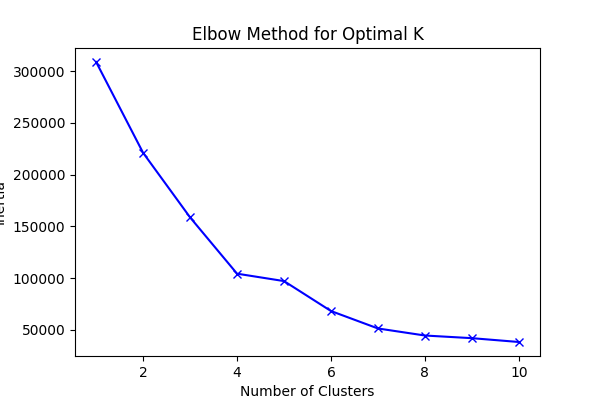
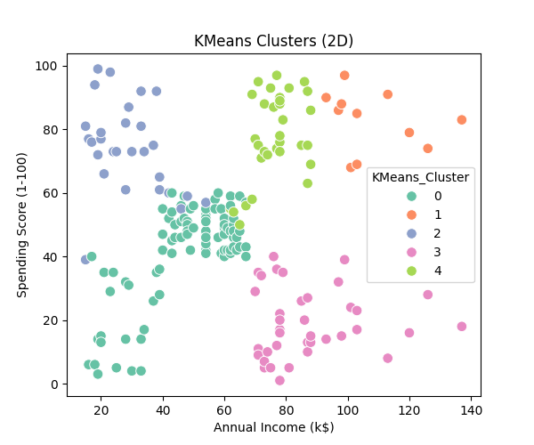
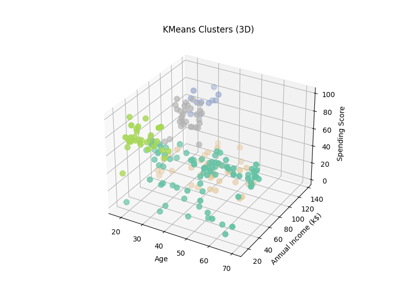
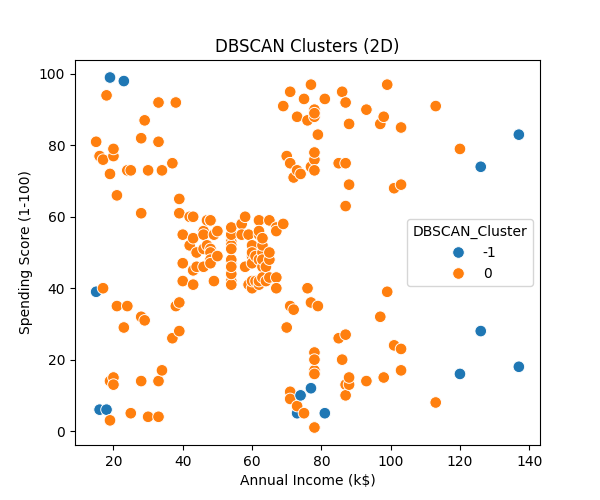
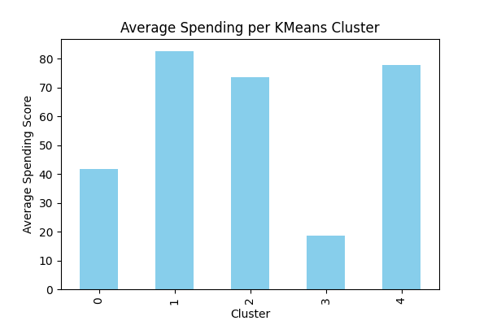

# 🛍️ Customer Segmentation (Mall Customers)

## 📌 Project Overview

This project performs **Customer Segmentation** using:

* **KMeans Clustering**
* **DBSCAN (Bonus)**

We use customer demographics (**Age, Income, Spending Score**) to group shoppers into meaningful clusters.

---

## ⚙️ Tools & Libraries

* Python 🐍
* Pandas
* Matplotlib
* Seaborn
* Scikit-learn

---

## 📊 Results & Visualizations

### 1. Elbow Method for Optimal Clusters

### 2. KMeans Clusters (2D)

### 3. KMeans Clusters (3D)

### 4. DBSCAN Clusters (Bonus)

### 5. Average Spending per Cluster (Bonus)

---

## 🎯 Covered Topics

* Clustering
* Unsupervised Learning
* KMeans & DBSCAN

---

## 🚀 Bonus Extensions

* ✅ DBSCAN clustering
* ✅ Average spending per cluster

---
